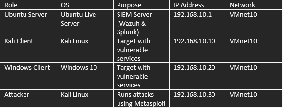
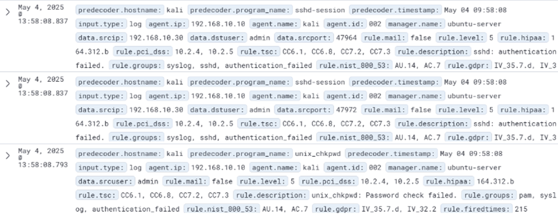
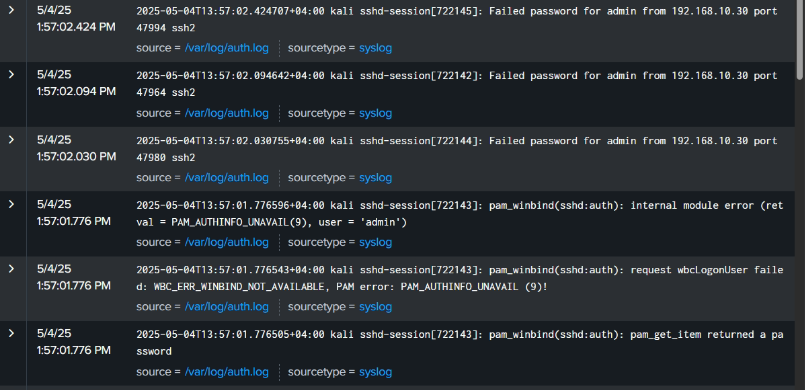

# SIEM/SOC Project: Attack Simulation and Monitoring

## Project Overview
This project demonstrates a Security Information and Event Management (SIEM) and Security Operations Center (SOC) environment built using VMware Workstation. It features a hybrid network of Windows and Linux virtual machines, with Wazuh and Splunk for real-time monitoring and Kali Linux for simulating cyberattacks. The lab showcases the setup, attack simulation, and log analysis, highlighting skills in cybersecurity and network management.

## Key Features
- **Hybrid Network**: Configured Ubuntu Server, Kali Linux, and Windows 10 VMs on a custom VMnet10 network (192.168.10.0/24).
- **SIEM Tools**: Deployed Wazuh (v4.11.2) and Splunk for monitoring and log analysis.
- **Attack Simulation**: Performed brute-force attacks on SSH, SMB, and RDP, plus an Apache exploit, using Metasploit.
- **Log Analysis**: Captured and analyzed security events via Wazuh dashboards and Splunk interfaces.

## Skills Demonstrated
- Virtualization and network setup (VMware Workstation).
- SIEM tool configuration (Wazuh, Splunk).
- Penetration testing with Metasploit.
- Incident detection and log analysis.

## Screenshots
| Wazuh Alerts | Splunk Logs |
|--------------|-------------|
|  |  |

## Project Structure
- `docs/`: Detailed lab report (`Lab_Report.md`) and setup guide (`Setup_Guide.md`).
- `screenshots/`: Visual evidence of setup, attacks, and detections.
- `scripts/`: Automation scripts for Wazuh installation, Splunk configuration, and Metasploit attacks.

## How to Explore
1. Read [Lab_Report.md](docs/Lab_Report.md) for a comprehensive overview and results.
2. Check [Setup_Guide.md](docs/Setup_Guide.md) for environment configuration details.
3. View screenshots in the `screenshots/` folder for visual proof of Wazuh alerts, Splunk logs, and more.
4. Examine scripts in the `scripts/` folder for automation examples.

## License
This project is licensed under the MIT License - see [LICENSE](LICENSE) for details.