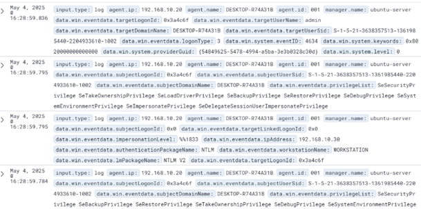

# SIEM/SOC Environment Setup and Attack Simulation Report

**Author**: Hamidov Hasan  
**Date**: May 2025

## Table of Contents
1. [Purpose](#purpose)
2. [Prerequisites](#prerequisites)
3. [Requirements](#requirements)
4. [Instructions](#instructions)
   - [4.1 Virtual Machine Setup](#41-virtual-machine-setup)
   - [4.2 Network Configuration](#42-network-configuration)
   - [4.3 Vulnerable Application Installation](#43-vulnerable-application-installation)
   - [4.4 SIEM Tool Deployment (Wazuh and Splunk)](#44-siem-tool-deployment-wazuh-and-splunk)
   - [4.5 Attack Simulation and Log Collection](#45-attack-simulation-and-log-collection)
   - [4.6 Evidence of Detections](#46-evidence-of-detections)
5. [Conclusion](#conclusion)

## Purpose
This lab was conducted to establish a Security Information and Event Management (SIEM) and Security Operations Center (SOC) environment from scratch. The objectives were to:
- Set up a hybrid network of Windows and Linux machines.
- Deploy industry-standard monitoring tools: Wazuh and Splunk.
- Configure agents to report data from vulnerable target systems to the monitoring tools.
- Simulate realistic cyberattacks using Kali Linux and collect logs/evidence.
- Evaluate how Wazuh and Splunk detect and report security events.
- Gain operational experience in:
  - Installing and configuring SIEM agents.
  - Monitoring network traffic.
  - Responding to real-time events.
  - Maintaining tool-specific environments to avoid conflicts.

## Prerequisites
The lab was conducted with the following prerequisites:
- **Knowledge**: Basic understanding of Windows/Linux operating systems, networking, and cybersecurity fundamentals.
- **Virtualization Platform**: VMware Workstation was used to create and manage virtual machines.
- **Installation ISOs**:
  - Ubuntu Live Server (for the monitoring server)
  - Kali Linux (for the Kali client and attacker machines)
  - Windows 10 (for the Windows client)
- **Internet Access**: All machines had internet access for downloading updates and agent installers.
- **System Resources**:
  - Total disk space: 300 GB (across all VMs).
  - Total RAM: 32 GB (distributed across VMs).

## Requirements

### VM Setup
The lab environment consisted of the following virtual machines:

| Role           | OS                 | Purpose                       | IP Address    | Network |
|----------------|--------------------|-------------------------------|---------------|---------|
| Ubuntu Server  | Ubuntu Live Server | SIEM Server (Wazuh & Splunk)  | 192.168.10.1  | VMnet10 |
| Kali Client    | Kali Linux         | Target with vulnerable services | 192.168.10.10 | VMnet10 |
| Windows Client | Windows 10         | Target with vulnerable services | 192.168.10.20 | VMnet10 |
| Attacker       | Kali Linux         | Runs attacks using Metasploit | 192.168.10.30 | VMnet10 |

### Network Setup
- All machines were configured on the same internal network (VMnet10: 192.168.10.0/24) for internal communication.
- Ubuntu Server had an additional NAT interface (192.168.75.128, DHCP) for internet access.
- Traffic Routing: The monitoring server (Ubuntu Server at 192.168.10.1) was used to monitor traffic from target machines.

### Monitoring Server
- **Chosen Tools**:
  - Wazuh (version 4.11.2): Deployed on Ubuntu Server (192.168.10.1). Interface: `https://192.168.10.1:443`
  - Splunk: Deployed on the same server. Interface: `http://192.168.10.1:8000`
- **Setup**:
  - Wazuh was installed as a single-node cluster:
    - Wazuh Indexer: 192.168.10.1
    - Wazuh Manager: 192.168.10.1
    - Wazuh Dashboard: 192.168.10.1
  - Splunk was configured to collect and analyze logs from target machines.

### Target Machines
- **Kali Client (192.168.10.10)**:
  - Installed vulnerable applications:
    - SSH (vulnerable due to default credentials).
    - SMB (vulnerable due to default credentials).
    - HTTP Apache (vulnerable configuration).
  - Vulnerable account: Username `admin`, Password `password`.
  - Wazuh agent and Splunk Universal Forwarder installed to forward logs.
- **Windows Client (192.168.10.20)**:
  - Installed vulnerable applications:
    - SSH (vulnerable due to default credentials).
    - RDP (vulnerable due to default credentials).
    - SMB (vulnerable due to default credentials).
  - Vulnerable account: Username `admin`, Password `password`.
  - Wazuh agent and Splunk Universal Forwarder installed to forward logs.

### Attacker Machine
- **Attacker (192.168.10.30, Kali Linux)**:
  - Used for attack simulation with tools like Metasploit.
  - Connected to the internal network (VMnet10) and had access to target machines (192.168.10.10 and 192.168.10.20).
  - Wordlist prepared: `/usr/share/wordlists/metasploit/user.txt`

## Instructions

### 4.1 Virtual Machine Setup
- **VM Creation**: VMware Workstation was used to create four VMs: Ubuntu Live Server, Kali Linux (Kali Client), Windows 10, and Kali Linux (Attacker).
- **Network Assignment**: Each VM was assigned to the VMnet10 network (192.168.10.0/24).
- **IP Assignments**:
  - Ubuntu Server: 192.168.10.1 (Static, VMnet10), 192.168.75.128 (DHCP, NAT)
  - Kali Client: 192.168.10.10 (Static, VMnet10)
  - Windows Client: 192.168.10.20 (Static, VMnet10)
  - Attacker: 192.168.10.30 (Static, VMnet10)

### 4.2 Network Configuration
- All VMs were connected to the VMnet10 network (192.168.10.0/24).
- Ubuntu Server had an additional NAT interface (192.168.75.128) for internet access.
- Connectivity was verified by ensuring all machines could communicate within VMnet10 and access the internet via the NAT interface.

### 4.3 Vulnerable Application Installation
- **Kali Client (192.168.10.10)**:
  - Installed:
    - SSH (default credentials: `admin/password`).
    - SMB (default credentials: `admin/password`).
    - HTTP Apache (vulnerable configuration).
  - Created vulnerable account: Username `admin`, Password `password`.
- **Windows Client (192.168.10.20)**:
  - Installed:
    - SSH (default credentials: `admin/password`).
    - RDP (default credentials: `admin/password`).
    - SMB (default credentials: `admin/password`).
  - Created vulnerable account: Username `admin`, Password `password`.
- **Clean Snapshot**: Saved a “clean” snapshot of each target machine after installing applications and accounts, before SIEM agent installation.

### 4.4 SIEM Tool Deployment (Wazuh and Splunk)
- **Wazuh Deployment (192.168.10.1)**:
  - Wazuh 4.11.2 installed on Ubuntu Server:
    - Indexer: 192.168.10.1
    - Manager: 192.168.10.1
    - Dashboard: 192.168.10.1
    - Interface: `https://192.168.10.1:443`
  - Wazuh agents installed on Kali Client and Windows Client.
  - See `scripts/wazuh_install.sh` for installation details.
- **Splunk Deployment (192.168.10.1)**:
  - Splunk installed on Ubuntu Server.
  - Interface: `http://192.168.10.1:8000`
  - Splunk Universal Forwarders installed on Kali Client and Windows Client.
  - See `scripts/splunk_config.conf` for sample configuration.

### 4.5 Attack Simulation and Log Collection
- **Attack Simulation**:
  - Attacker (192.168.10.30, Kali Linux) used Metasploit to simulate attacks.
  - Wordlist: `/usr/share/wordlists/metasploit/user.txt`
  - Targeted vulnerable accounts (`admin/password`) on both machines.
  - See `scripts/metasploit_attack.ms` for sample attack script.
- **Attacks on Kali Client (192.168.10.10)**:
  - SSH: Brute-force attack using `admin/password`.
  - SMB: Brute-force attack using `admin/password`.
  - HTTP Apache: Exploited vulnerable configuration.
- **Attacks on Windows Client (192.168.10.20)**:
  - SSH: Brute-force attack using `admin/password`.
  - RDP: Brute-force attack using `admin/password`.
  - SMB: Brute-force attack using `admin/password`.
- **Log Collection**:
  - **Wazuh**: Detected all attacks. Logs stored in `/var/log/wazuh-install.log`. Alerts in dashboard (`https://192.168.10.1:443`).
  - **Splunk**: Collected logs from both target machines. Analyzed via `http://192.168.10.1:8000`.

### 4.6 Evidence of Detections

#### Kali Client (192.168.10.10) Detections
- **SSH Attack**:
  - Brute-force attack performed on SSH using `admin/password`.
  - Wazuh Log: Alerts generated in dashboard.
  - Splunk Log: Logs collected and displayed.

    
  

- **SMB Attack**:
  - Brute-force attack performed on SMB using `admin/password`.
  - Wazuh Log: Alerts generated in dashboard.
  - Splunk Log: Logs collected and displayed.

    
  

- **HTTP Apache Attack**:
  - Exploit performed on HTTP Apache vulnerable configuration.
  - Wazuh Log: Alerts generated in dashboard.
  - Splunk Log: Logs collected and displayed.

    
  

#### Windows Client (192.168.10.20) Detections
- **SSH Attack**:
  - Brute-force attack performed on SSH using `admin/password`.
  - Wazuh Log: Alerts generated in dashboard.
  - Splunk Log-Russian: Logs collected and displayed.

    
  

- **RDP Attack**:
  - Brute-force attack performed on RDP using `admin/password`.
  - Wazuh Log: Alerts generated in dashboard.
  - Splunk Log: Logs collected and displayed.

    
  

- **SMB Attack**:
  - Brute-force attack performed on SMB using `admin/password`.
  - Wazuh Log: Alerts generated in dashboard.
  - Splunk Log: Logs collected and displayed.

    
  

## Conclusion
This report summarizes the setup of a SIEM/SOC environment, the simulation of attacks on the Kali Client and Windows Client, and the successful operation of Wazuh and Splunk. All systems functioned seamlessly, vulnerabilities were exploited, and attacks were logged effectively. Both Wazuh and Splunk provided robust monitoring and analysis of security events, demonstrating their effectiveness in a simulated environment. This project showcases skills in virtualization, SIEM tool deployment, network configuration, penetration testing, and log analysis.

For setup details, see [Setup_Guide.md](docs/Setup_Guide.md). For scripts, see the `scripts/` folder. Additional screenshots are in the `screenshots/` folder.
